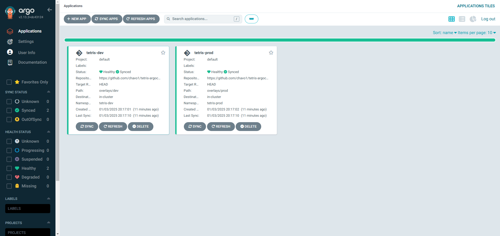

# Vagrant<->Argocd POC
## Prerequisites
[Vagrant](https://www.vagrantup.com/)
[Kubernetes](https://kubernetes.io/docs/setup/)
[kubectl configured](https://argo-cd.readthedocs.io/en/stable/operator-manual/installation/)

### Lets start
##### clone the repo
```
git clone https://github.com/chavo1/vagrant-argocd.git
cd vagrant-argocd
vagrant up
```

### === Access Information ===
#### Development Environment:
URL: http://192.168.56.11:30001
#### Production Environment:
URL: http://192.168.56.11:30002

#### ArgoCD Dashboard:
URL: https://192.168.56.11:8080</br>
Username: admin</br>
Password: just copy or open "/vagrant/argocd-password.txt"

[](http://192.168.56.11:8080)
[](http://192.168.56.11:8080)
[](http://192.168.56.11:30001)
